<table align="center">
  <tr>
    <td>
      
    </td>
    <td>
      <h1>auto-complete</h1>
    </td>
  </tr>
</table>

<p align="center">
  <strong>Built for my lazy self so that I don't have to care about assignments at all.</strong>
</p>


<br>

---
<br>

<p align="center">
  Auto-Complete is a full-stack automation platform that connects Google Classroom, Google Drive, Gemini, and MongoDB<br/>
  to turn a Classroom assignment into a finished, uploaded document — without manual steps in between.
</p>

<br>

<p align="center">
  <video src="./src/assets/demo.mp4" autoplay loop muted playsinline width=500></video>
</p>

<br>
<br>
<br>

<p align="center">
  <a href="https://auto-complete-automation.vercel.app"></a>
  <a href="https://auto-complete-ywqk.onrender.com/health"></a>
  <a href="./src/assets/demo.mp4"></a>
  
</p>
<br>
<p align="center">
  
</p>
<br>
<br>


## How it all started

University assignments are tedious and involve the same sequence of actions, over and over:

Check Classroom. Open the assignment. Find the attached material. Download it. Process it. Prepare a solution. Create a document. Upload it.

Each step is trivial on its own. The repetition is what actually costs time.

Auto-Complete started from one simple question:

> **What if this entire workflow became a system instead of a routine?**

<br>


<br>

<br>


# V1 — The First Working System

<br>

> V1 answers a single question: *can the entire assignment workflow be automated end-to-end, reliably, for one user?*

<br>

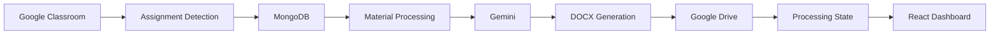

<br>

**Implemented** — this is the system as it runs in production today.

<br>

### Google Classroom API

Manually tracking assignments defeats the purpose of automation. The application needed to know, directly from the source of truth, which courses exist, which assignments exist, and which materials are attached to them. Connecting to the Classroom API is what turned this from a local script into a system interacting with a real external service.

<br>

### MongoDB

Retrieving assignments from Classroom is only half the problem — the application also has to remember what it already did. Without persistence, every request would be treated as brand new, and there would be no way to track processing state, store generated solution metadata, or avoid redoing work. MongoDB Atlas became the persistent state layer, storing courses, assignments, materials, processing state, users, sessions, and notifications.

<br>

### File-processing pipeline

Assignment materials aren't always plain text — they can be PDFs, DOCX files, Google Docs, or other Classroom-linked resources. That meant building a real pipeline to inspect, download, and process files, rather than assuming a single input format. Files are downloaded and processed only when required and removed once the workflow completes.

<br>

### Gemini

Once the material was reliably retrieved and processed, the next problem was turning it into a structured solution.

Gemini is given an extensive prompt containing the assignment context, extracted material, and detailed instructions on how the solution should be generated and formatted. Instead of returning plain text, the model is instructed to produce a structured JSON object that captures the solution in a predictable format.

<br>


### DOCX generation

The JSON response from Gemini is then parsed and passed to the document-generation layer, which converts the structured output into a formatted DOCX. The current pipeline supports formatting including headings, paragraphs, numbered and bulleted lists, tables, formatted text, and code blocks.

<br>

### Upload back to Google Drive

The point of automation is to return the result to where the user already works. Uploading the generated DOCX to Drive means the output lands directly in the user's existing Google workflow, instead of creating a separate workspace where the user has to go and check.

<br>

### React dashboard

With the backend pipeline working, the project needed a single control surface instead of several disconnected services. The dashboard exposes courses, assignments, assignment status and details, processing controls, regeneration, results, and notifications.

<br>

### Google OAuth + Sessions

Google OAuth handles authentication, so any user can sign in and access the application after successfully authenticating with Google. Express sessions, backed by MongoDB, keep that authenticated state alive across requests.

Authorization is handled separately. Since V1 is not a multi-user system and the dashboard currently displays the owner's assignment data, only the configured owner is authorized to perform actions that modify or trigger changes to that data. Other authenticated users can access the application, but data-changing operations are restricted to the owner.

This creates the following security flow:


Google OAuth → callback → session → cookie → CORS → authentication → owner authorization → protected actions

<br>

## V1 Architecture ( Current Production ) 

<br>

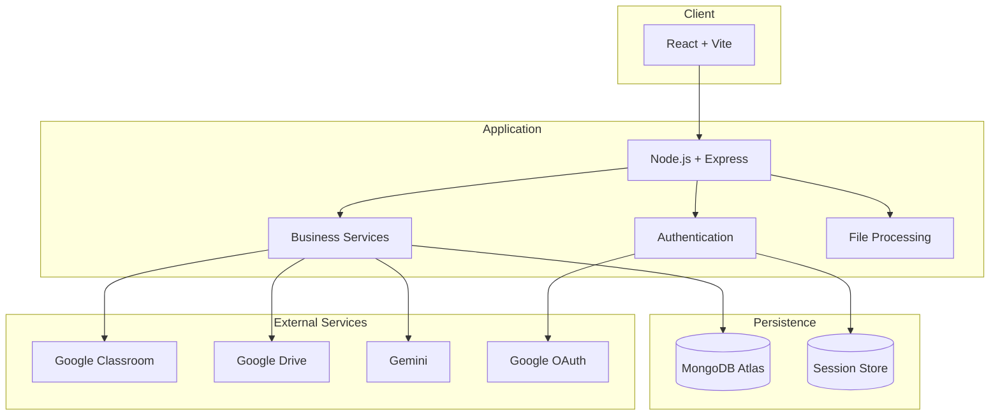
<br>
<br>


## V1 Processing Pipeline ( Current Production ) 

<br>
<br>

```mermaid
flowchart LR
    A[Google Classroom]
    --> B[Detect Assignment]
    --> C[Persist Assignment]
    --> D[Inspect Materials]
    --> E[Download Files]
    --> F[Process / Extract Content]
    --> G[Gemini]
    --> H[Generate Solution]
    --> I[Create DOCX]
    --> J[Upload to Drive]
    --> K[Update Assignment State]
    --> L[Cleanup]
```
<br>
<br>

<table border=1>
  <tr>
    <th>Stage</th>
    <th>Responsibility</th>
  </tr>
  <tr>
    <td>Detect</td>
    <td>Retrieve assignments from Google Classroom</td>
  </tr>
  <tr>
    <td>Store</td>
    <td>Persist assignment metadata in MongoDB</td>
  </tr>
  <tr>
    <td>Inspect</td>
    <td>Determine the materials required for processing</td>
  </tr>
  <tr>
    <td>Download</td>
    <td>Retrieve and prepare files for processing</td>
  </tr>
  <tr>
    <td>Generate</td>
    <td>Send relevant assignment data to Gemini</td>
  </tr>
  <tr>
    <td>Create</td>
    <td>Convert structured output into a formatted DOCX</td>
  </tr>
  <tr>
    <td>Upload</td>
    <td>Upload the generated document to Google Drive</td>
  </tr>
  <tr>
    <td>Update</td>
    <td>Persist the processing state</td>
  </tr>
  <tr>
    <td>Cleanup</td>
    <td>Remove temporary files after processing</td>
  </tr>
</table>

<br>
<br>

Persistent processing state matters here because the application needs to know what's already been processed, rather than treating every request as a fresh operation.

<br>


## V1 Limitation — Built for One User

V1 is intentionally designed around a **single-user, owner-oriented workflow**. Authorization currently distinguishes authenticated vs. unauthenticated and owner vs. non-owner requests, but it does not yet model many independent users each with their own isolated data and Google tokens.

This is sufficient for V1's actual goal: **proving the complete workflow end-to-end**, from Classroom detection through AI generation to a delivered document — before investing in the complexity of a multi-tenant system.

If multiple independent users relied on this deployment simultaneously today, assignment data, processing state, and OAuth tokens would need to become user-scoped rather than owner-scoped. That gap is exactly what motivates V3.


<br>
<br>
<br>

# V2 — Making the System Resilient (Planned)

<br>

> V2 answers the question: *can I make the system more smarter and reliable?*

<br>


### WebSockets

Today, checking on a long-running assignment means the frontend has to ask the backend for status. A WebSocket connection would let the backend push processing updates to the frontend as they happen, instead of the client polling for them.

<br>

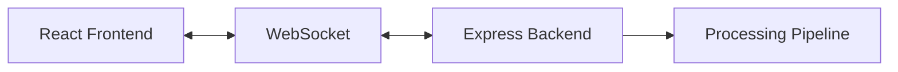

<br>

### Retries

Every external dependency — Classroom, Drive, Gemini, OAuth — is a potential point of transient failure. A retry strategy would distinguish recoverable failures from permanent ones and back off accordingly, rather than failing an entire assignment on a single dropped request.

<br>

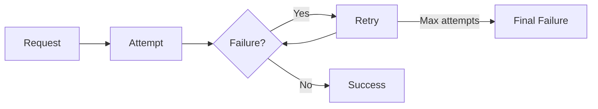

<br>


### Personalized Prompt System 

V1 can regenerate a solution, but regeneration is essentially a fresh generation. If the user is unhappy with the result, Gemini is not given any information about what was wrong with the previous attempt. The same prompt can therefore produce another solution with the same underlying issue — while consuming another API call.

A more personalized system would capture user feedback alongside the assignment context, course context, and original material. That feedback could then be incorporated into the next generation, allowing regeneration to address a specific problem rather than simply asking Gemini to try again.

<br>

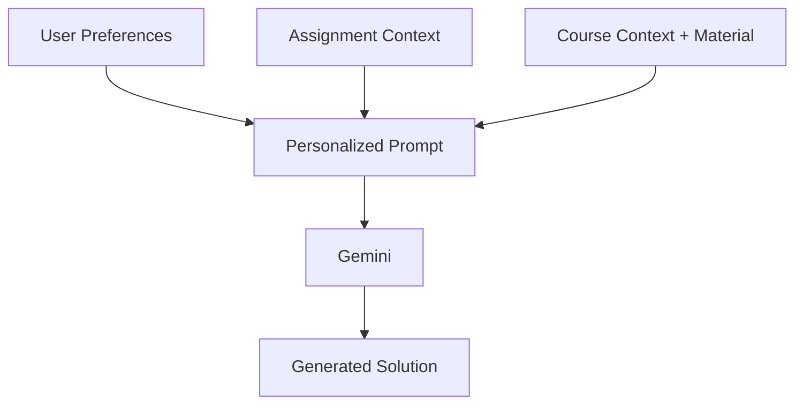

<br>
<br>


## V2 Architecture (Planned)

<br>

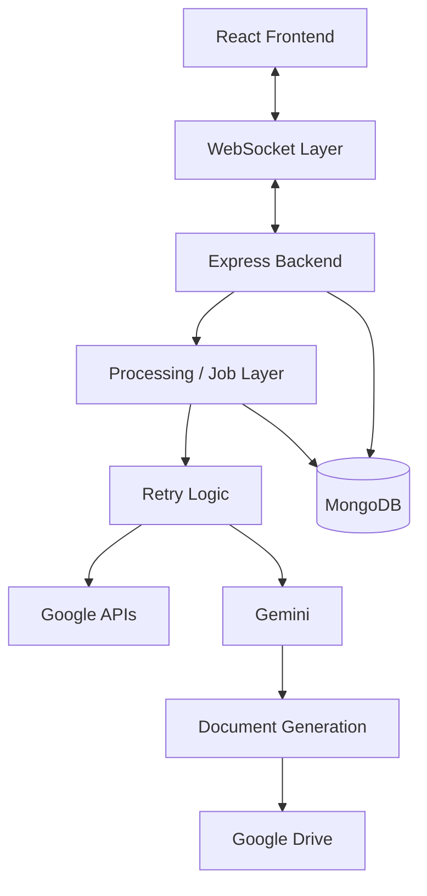
<br>

The intent is to move from a simple request/response application toward a processing architecture that can absorb external failures and keep the user informed while it does.

<br>

<br>

# V3 — Multi-User Support (Future Architecture)

> V1 solved the workflow.
<br>

> V2 makes the workflow resilient.
<br>

> V3 asks whether the same architecture can support many users at once.

<br>

### Multi-user authentication

V1's authorization model is owner-oriented: it distinguishes the application's owner from other requests. A multi-user version would need real user identity, per-user sessions, and per-user Google OAuth tokens, with authorization scoped to "does this user own this record" rather than "is this the owner."

<br>

### Data isolation

MongoDB records currently represent one owner's courses, assignments, and generated documents. Supporting many users means every record needs to be scoped to the user who owns it:

<br>

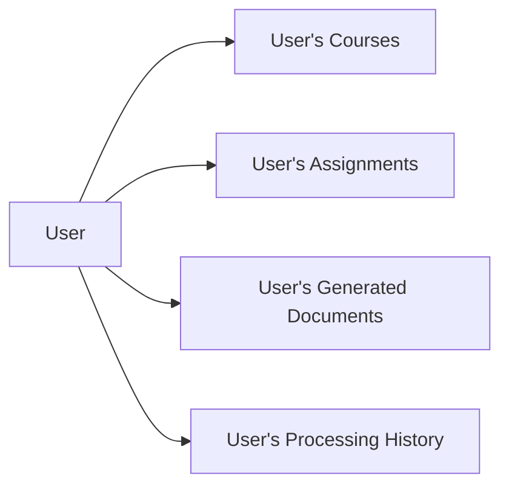

<br>

Without this, one user's data could be visible to — or processed as if it belonged to — another. Isolation isn't an optimization here; it's a correctness and security requirement.

<br>

### Background processing

Assignment processing currently happens within the lifecycle of an HTTP request. That's workable for one user at a time, but a long-running Gemini call or file download shouldn't block a request thread once multiple users are triggering processing concurrently. The natural evolution is moving processing off the request path entirely:

<br>

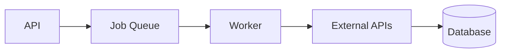

<br>

### Concurrency

Multiple users triggering processing at the same time raises questions the current single-user model doesn't have to answer: how many jobs can run concurrently, how external API rate limits get shared fairly across users, how retries behave when several jobs fail at once, how job state stays consistent, and how processing stays idempotent if a job is retried or resumed.

<br>

### Scaling the backend

A single Express instance is enough for one user. Supporting many would mean:

<br>

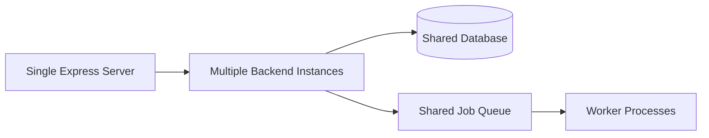

<br>

Load balancing and horizontal scaling belong here — as future direction, not current capability.

<br>

### External API limits

Auto-Complete depends heavily on Google APIs and the Gemini API. At multi-user scale, this introduces per-user quotas, shared rate limits, backoff strategies, and the need to isolate one user's failures or quota exhaustion from affecting everyone else.

<br>
<br>

## V1 vs V2 vs V3

<br>
<br>

<table border="1">
  <thead>
    <tr>
      <th></th>
      <th><strong>V1 — Implemented</strong></th>
      <th><strong>V2 — Planned</strong></th>
      <th><strong>V3 — Future Architecture</strong></th>
    </tr>
  </thead>
  <tbody>
    <tr>
      <td><strong>Architecture</strong></td>
      <td>Request/response</td>
      <td>Request/response + WebSocket + retries</td>
      <td>Job queue + workers, horizontally scaled</td>
    </tr>
    <tr>
      <td><strong>Users</strong></td>
      <td>Single owner</td>
      <td>Single owner</td>
      <td>Many independent users</td>
    </tr>
    <tr>
      <td><strong>Processing</strong></td>
      <td>Synchronous, in-request</td>
      <td>Synchronous, with retry handling</td>
      <td>Asynchronous, background jobs</td>
    </tr>
    <tr>
      <td><strong>Failure handling</strong></td>
      <td>Basic error handling</td>
      <td>Retry logic for transient failures</td>
      <td>Isolated failures, per-user backoff</td>
    </tr>
    <tr>
      <td><strong>Realtime updates</strong></td>
      <td>Polling / manual refresh</td>
      <td>WebSocket push updates</td>
      <td>WebSocket at scale, per-user channels</td>
    </tr>
    <tr>
      <td><strong>Prompt system</strong></td>
      <td>Generic prompt to Gemini</td>
      <td>Personalized prompt context</td>
      <td>Personalized, user- and course-aware at scale</td>
    </tr>
    <tr>
      <td><strong>Persistence</strong></td>
      <td>MongoDB, owner-scoped</td>
      <td>MongoDB, owner-scoped</td>
      <td>MongoDB, user-scoped, tenant-isolated</td>
    </tr>
    <tr>
      <td><strong>Concurrency</strong></td>
      <td>Not a concern (one user)</td>
      <td>Not a primary concern</td>
      <td>Core design constraint</td>
    </tr>
    <tr>
      <td><strong>Scaling</strong></td>
      <td>Single backend instance</td>
      <td>Single backend instance</td>
      <td>Multiple instances, shared queue</td>
    </tr>
    <tr>
      <td><strong>Primary goal</strong></td>
      <td>Prove the workflow works</td>
      <td>Make the workflow resilient</td>
      <td>Support many users safely</td>
    </tr>
  </tbody>
</table>

<br>

This table shows evolution, not ranking — each version is the right architecture for the problem it was solving at the time.

<br>


## Tech Stack

<br>

<p align="center">
  
</p>

<br>

<p align="center">
  
  
  
  
  
</p>

<br>

**Frontend** — React · Vite · React Router · Tailwind CSS . React Hot Toast

**Backend** — Node.js · Express · Express Session · Mongoose · MongoDB · Google APIs · Google OAuth · Gemini API


**Infrastructure** — Vercel · Render · MongoDB Atlas 

<br>


## Database

MongoDB Atlas is the persistent state layer for the application.

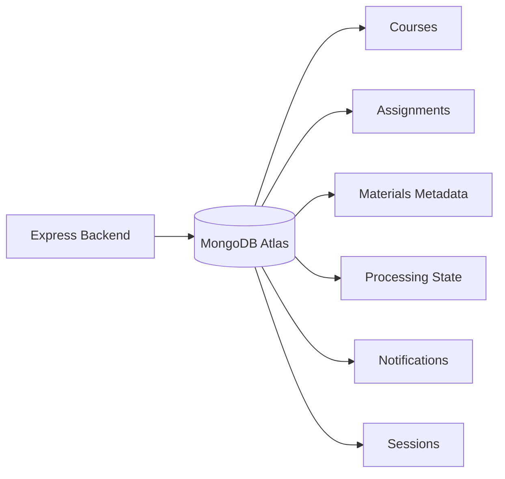

<br>

Mongoose handles database interaction. This is a conceptual view of the collections described in the project rather than a full schema — it reflects what the codebase's documented models represent, not exact field-level structure.

<br>


## Project Structure

```text
auto-complete/
│
├── backend/
|   ├── automation_pipeline/
│   ├── middleware/
│   ├── routes/
│   ├── scheduler/
│   ├── services/
│   │   ├── google/
│   │   ├── ai/
│   │   ├── mongoose/
│   │   └── ...
│   ├── utils/
│   └── server.js
│   └── app.js
│   └── startup.js
|
├── models/
|
├── src/
│   ├── components/
│   ├── pages/
│   ├── context/
│   ├── assets/
│   ├── App.jsx
│   └── main.jsx
│
├── public/
|
├── package.json
├── vite.config.js
├── vercel.json
├── .gitignore
├── README.md
├── license.md
└── ...
```

<br>

## Deployment

<br>

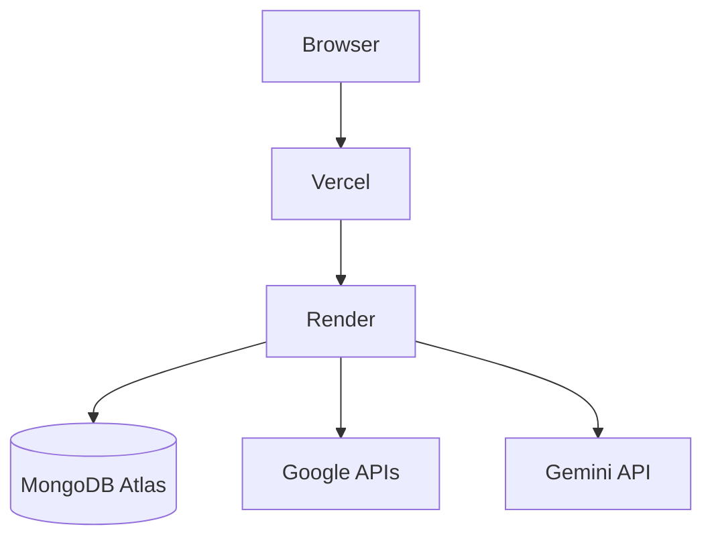

<br>
<br>

<table border="1">
  <tr>
    <th>Layer</th>
    <th>Service</th>
  </tr>
  <tr>
    <td>Frontend hosting</td>
    <td>Vercel</td>
  </tr>
  <tr>
    <td>Backend hosting</td>
    <td>Render</td>
  </tr>
 
  <tr>
    <td>Database</td>
    <td>MongoDB Atlas</td>
  </tr>
</table>

<br>

The frontend and backend are deployed as independent services, communicating over HTTPS, with the database hosted separately on MongoDB Atlas.

<br>

## Security

The repository must never contain:

```text
.env
.env.*
credentials.json
oauth.json
google-api-token.json
```

Sensitive values include MongoDB connection strings, Google client secrets, Gemini API keys, session secrets, OAuth tokens, private keys, and service-account credentials.

`.gitignore` protects against accidental commits going forward, but it does not remove secrets already present in Git history. If a secret is ever publicly exposed, it should be revoked or rotated immediately.

<br>

## Local Development

<br>

### Requirements

Node.js · npm · Git · MongoDB Atlas · Google Cloud project · Google OAuth credentials · Google Classroom API · Google Drive API · Gemini API

<br>

### Setup

```bash
cd auto-complete
git clone https://github.com/rizviammar579/auto-complete
npm install
```

<br>

### Environment Variables

Create a `.env` file in the project root and add:

<br>

```env
GEMINI_API_KEY=your_gemini_api_key
GEMINI_MODEL=your_preferred_gemini_model

# See backend/services/ai/geminiModels.txt for supported models

GOOGLE_CLIENT_ID=your_google_oauth_client_id
GOOGLE_CLIENT_SECRET=your_google_oauth_client_secret
GOOGLE_CALLBACK_URL=http://localhost:3000/auth/google/callback

MONGODB_USERNAME=your_mongodb_atlas_username
MONGODB_PASSWORD=your_mongodb_atlas_password
MONGODB_URI=your_mongodb_atlas_connection_string

SESSION_SECRET=your_random_session_secret

OWNER_EMAILS=abcd@gmail.com,xyz@mail.jiit.ac.in

FRONTEND_URL=http://localhost:5173
VITE_BACKEND_URL=http://localhost:3000
```

<br>

## Secret & Credential Files

Auto-Complete requires a few credential files for Google API and OAuth functionality.

These files contain sensitive credentials and **must never be committed to Git**.

<br>

### Required Files

| File | Purpose | How it is obtained |
|---|---|---|
| `credentials.json` | Google Drive and Google Classroom API credentials | Download from Google Cloud Console |
| `oauth.json` | Google OAuth 2.0 client credentials | Download/configure from Google Cloud Console |
| `google-api-token.json` | Stores the Google API authentication token | Automatically generated on the first run |

<br>
<br>

### `credentials.json`

This file contains the credentials required to access the Google Drive and Google Classroom APIs.

Place it in the root directory of the project before running the application.

<br>

### `oauth.json`

This file contains the Google OAuth 2.0 credentials used for user authentication.

Configure the OAuth client in Google Cloud Console and place the resulting credentials file in the root directory of the project.

<br>

### `google-api-token.json`

You do **not** need to create this file manually.

It is generated automatically when the application runs for the first time and completes the Google API authentication flow.

The generated token is then reused for subsequent API requests.

<br>


<br>

### Running locally

<br>

```bash
npm run dev      # frontend — http://localhost:5173
npm run server   # backend  — http://localhost:3000
```

<br>
<br>

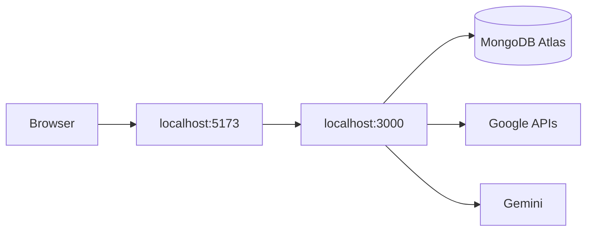

<br>
<br>


<br>

# Author

**Ammar Rizvi**

<br>

B.Tech student and software developer focused on backend engineering, web development, databases, distributed systems, open source, and software engineering.

<br>


<p align="center">
  <sub>Built from a problem. Evolved through engineering. Designed to keep evolving.</sub>
</p>

<p align="center">
  
</p>